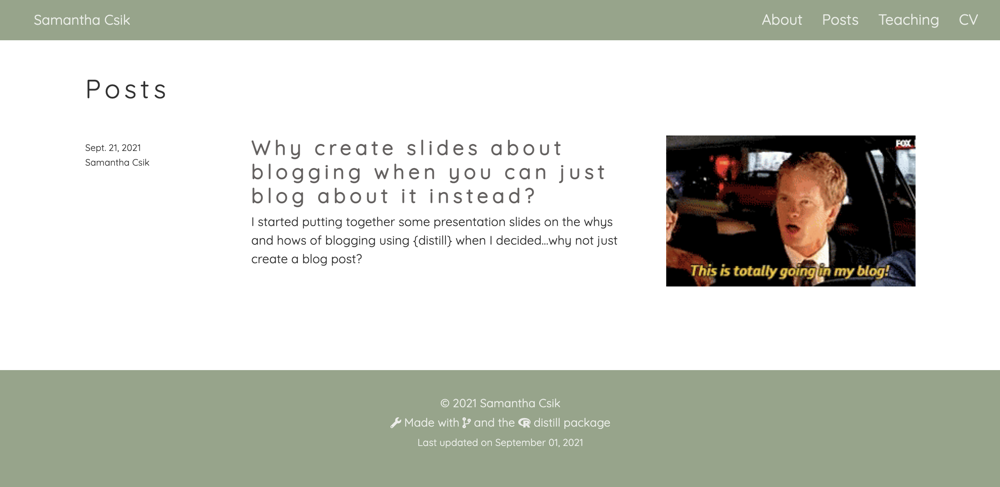

```{r setup, include=FALSE}
knitr::opts_chunk$set(echo = FALSE)
```

I am a total blog newb. 

*BUT* we all have to start somewhere. And my somewhere is leading a mini-workshop in T-6 days for our first Master of Environmental Data Science (MEDS) cohort (read more about this *awesome* new program [here](https://bren.ucsb.edu/masters-programs/master-environmental-data-science)) on why blogging as data scientists is an important and valuable skill to practice, what a good blog post might look like, and some of the technical aspects of creating blog posts using the {distill} package.

I originally set off on my self-education journey by digging into other data science-related blogs and throwing together some slides about what I found. I even practiced creating a fake blog post on my own (and very much still under development) [personal website](samanthacsik.github.io) in case anyone asked me to walk them through the steps (I can't look like I don't know what I'm doing now, right??).

Ten slides deep and then it struck me -- I was creating a presentation on how to blog without ever *actually* creating my own blog post?? Dammit. Doesn't quite feel right. So here we are. Baby's first blog post *~about blog posts~*. I'd say this first post is half meant to serve our MEDS students as they embark on their fall quarter (and will surely be asked to blog every now and again) and half meant to be the catalyst I so desperately needed to finally put a little bit of writing out there in the data science world.

So here we go! I'll start by sharing examples of different blogs that I think demonstrate a few creative ways to format and publish data science content. Then I'll review some of the cool things you can do with {distill} to customize your own beautiful posts.

## I. Why blog?

Data science blogging has become pretty darn popular in recent years, and for good reason. It can help you to build your online professional profile, enhance your communication skills, stay atop the latest and greatest tools, connect with other data scientists, and even solicit feedback from those in the community.

But one of the most


Teaching (see below) plus stuff you can come back to at a later date

You've probably heard the saying, "The best way to learn something is to teach it to others." -- there's science to back this up (read about the Feynman Learning Technique and the Protégé Effect)


## II. Structuring data science blog posts

There are *lots* of creative ways to blog (both for yourself and your target audience) about your data science journey. Here are just a few examples^[Many of the following blogs can be found on the [distillery](https://distillery.rbind.io/), a blog about building distill websites and blogs. Check it out!] that caught my eye.

### i. Compare popular tools to new alternatives

Harry Fisher ([Data, Code & Coffee](https://www.hfshr.xyz/)) explores on `{nakedpipe}` a new(er) alternative to `{magrittr}`'s `%>%` in his blog post, **Penguins and nakedpipes** [@fisher2020penguins].

```{r, out.width = '60%', echo = FALSE}
knitr::include_url("https://www.hfshr.xyz/posts/2020-06-21-penguins-and-nakedpipes/")
```

### ii. Describe *how* to use a tool and *when* it's appropriate to do so

[Eric Ekholm](https://www.ericekholm.com/) covers how to use the `{ggtext}` package to replace your use of ggplot legends with colored title text instead in his post, **Improving ggplots with Text Color** (@ee2021improving). Importantly, he discusses when it might be most appropriate to do so and when you might opt for an alternative method.

```{r, out.width = '60%', echo = FALSE}
knitr::include_url("https://www.ericekholm.com/posts/2021-03-24-improving-ggplots-with-text-color/")
```

### iii. Hold yourself accountable to a coding challenge (and teach others along the way!)

[Ella Kaye](https://ellakaye.rbind.io/) documents her progress through the 2020 [Advent of Code](https://adventofcode.com/), a series of small coding challenges, released daily through December in her post **Advent of Code, 2020** [@kaye2020advent].

```{r, out.width = '60%', echo = FALSE}
knitr::include_url("https://ellakaye.rbind.io/posts/2020-12-09-advent-of-code-2020/")
```

### i.v. Share what you learned at a conference

Danielle Brantley ([Data Sci Dani](https://datascidani.com/)) recaps her experiences at R Conference 2020 and provides brief overviews of the R packages she learned about along the way in her post, **Packages I Learned about at R Conference NYC** [@brantley2020packages]. 

```{r, out.width = '60%', echo = FALSE}
knitr::include_url("https://datascidani.com/posts/2020-08-20-packages-r-conference-nyc/")
```

### v. Present a coding problem and solution

Kaija Gahm ([woodpeckeR](https://kaijagahm.netlify.app/blog.html)) defines a coding problem, provides some context, and describes her solution along with why it works in her post, **%$%: upping your pipe game**.

```{r, out.width = '60%', echo = FALSE}
knitr::include_url("https://kaijagahm.netlify.app/posts/2020-02-10-upping-your-pipe-game/")
```

### vi. Share how you use code as a creative medium

[Ijeamaka Anyene](https://ijeamaka-anyene.netlify.app/) is a computational aRtist who shares her process of creating abstract geometrical rectangular designs (check out her 'Subdivisions Series' on her [Etsy shop](https://www.etsy.com/shop/ArtSnacksPrints?ref=simple-shop-header-name&listing_id=1088780421)) in her post, **So, you want to subdivide a rectangle** [@anyene2021so].

```{r, out.width = '60%', echo = FALSE}
knitr::include_url("https://ijeamaka-anyene.netlify.app/posts/2021-09-07-so-you-want-to-subdivide-a-rectangle")
```


### vii. Document the evolution of your code in multiple posts

Matt Kerlogue [(The Lapsed Geographer)](https://lapsedgeographer.london/) details his use of the `{pdftools}` and `tidyverse` packages in R to web scrape and wrangle COVID-19 data from UK reports in his post, **Scraping Google's COVID-19 mobility report PDFs** [@kerlogue2020scraping]. He later follows up with instructions on how to automate this process for reports from ~130 countries and all 50 US states in his post, **Automating the COVID-19 PDF scraping** [@kerlogue2020automating].

```{r, out.width = '60%', echo = FALSE}
knitr::include_url("https://lapsedgeographer.london/2020-04/covid19-scraping/")
```

Now that we're all feeling inspired to flex our creative data science muscles, let's create and customize our own blog posts `r icons::fontawesome("blog")`

## III. Adding a `{distill}` blog to your personal website 

***Disclaimer:** A lot of the following content (sections III & IV) is just a compilation of excellent existing resources. I learn by repeating things (usually many times), so taking the time to type out code/YAML headers has been helpful, albeit not at all novel. See a list of referenced resources at the bottom of this post.*

If you have not yet made a {distill} site, there are *many* great tutorials out there. For MEDS students, I recommend following along with these [step-by-step instructions](https://docs.google.com/document/d/1c0SZiVvp32UTJ9sK_yVjI8ou6pVdFRXsY2236tiTA1c/edit) by [Allison Horst](https://www.allisonhorst.com/) before moving forward. For a very brief intro on customizing your {distill} site using CSS, check out these [slides](https://ucsb-meds.github.io/customizing-websites-css/#1).

<aside>
*Note: The following section was adapted from @apreshill2020postcards*
</aside>

Now that you have your {distill} site up and running, you can create your first blog post by running the `distill::create_post()` function in your console:

```{r, eval = FALSE, echo = TRUE}
create_post(title = "My blog post")
```

If this is the **first time** you are creating a blog post, `distill` will add a directory called `_posts/`, which will contain this plus all future blog posts. You will also need to create a **listing page**, which will list all of your posts. Do this by adding a blank `.Rmd` file to your root directory by running `utils::file.edit("blog.Rmd")` in your console, then add a YAML header to your new file as follows:

```{r, eval = FALSE, echo = TRUE}
---
title: "Blog"  # any name you want
listing: posts # do this exactly
---
```

Finally, link your new listing page to your website's navbar by editing **`_site.yml`**. *Note: Since I named my listing `.Rmd` file as `blog.Rmd`, the href I need to link to is `blog.html`.*

```{r, eval = FALSE, echo = TRUE}
navbar:
  right:
    - text: "Home"
      href: index.html
    - text: "Blog"      # add 
      href: blog.html   # add
```

## IV. Customizing your `{distill}` blog & posts

A couple simple touches can go a long way in improving the look of your {distill} blog. Here are some of the steps I followed to customize my first blog post. 

<aside>
*Note: This section's content was largely adapted from @allaire2018distill*
</aside>

### i. Preview images

Preview images are those fun little thumbnails that appear alongside blog posts on your listing page:

```{r, echo = FALSE}

```

Add your image to the folder where your blog post `.Rmd` lives (e.g. `_posts` -> `YYYY-MM-DD-my-blog-post` -> `my_preview_image.jpeg`). Then, add the `preview` field to the YAML header of your blog post `.Rmd` file and set the value to the name of your preview image:

```{r, eval = FALSE, echo = TRUE}
---
title: "my blog post"
# (additional metadata excluded for brevity)
preview: my_preview_image.jpeg  # your preview image
---
```

### ii. Categories

You can assign each post to one or more "categories," making it easier for your readers to filter content. Do so by adding the `categories` field to the YAML header of your blog post `.Rmd` file, then list whichever self-defined categories you would like your post to be assigned to. For example, I assigned this blog post to a `distill` category:

```{r, eval = FALSE, echo = TRUE}
---
title: "Why create slides about blogging when you can just blog about it instead?"
# (additional metadata excluded for brevity)
categories:
  - distill # list as many categories as you'd like 
---
```

Take a look at your listing page to see all your categories (and how many articles are assigned to each). Assigned categories will also appear as metadata at the top of each post. 

### iii. Table of contents

Table of contents can be helpful for readers to navigate longer posts. Add the `toc` (and optionally, `toc_float`) field to your blog's YAML header as shown below: 

```{r, eval = FALSE, echo = TRUE}
---
title: "my blog post"
# (additional metadata excluded for brevity)
output:
  distill::distill_article:
    self_contained: false
    toc: true              # add a table of contents
    toc_float: true        # float it (positioned on the left-hand side, rather at the top)
---
```

### iv. Citations

You can add automatically-generated citations to the bottom of your posts, making it easier for readers to reference your work. 

I did this by first adding the `base_url` field to my **`_site.yml`** and set the value to the landing page URL of my {distill} site. For example:

```{r, eval = FALSE, echo = TRUE}
---
name: "samanthacsik.github.io"
title: "Samantha Csik"
# (additional metadata excluded for brevity)
base_url: samanthacsik.github.io # add your website's landing page url
---
```

I then specified the [slug](https://developer.mozilla.org/en-US/docs/Glossary/Slug) (the unique identifying part of a web address) in the YAML header of my blog post `.Rmd` file (a slug will be automatically generated if not provided):

```{r, eval = FALSE, echo = TRUE}
---
title: "Why create slides about blogging when you can just blog about it instead?"
# (additional metadata excluded for brevity)
slug: csik2021firstBlog
---
```

Your citations will now appear as metadata at the bottom of your post upon knitting:

[ADD SCREENSHOT HERE] 

### v. Bibliographies

You can use standard [R Markdown bibliographies](https://pandoc.org/MANUAL.html#citations) to cite works throughout your post and include a corresponding "References" list. You will first need to create a `.bib` file in the folder containing your blog post. You can do so by running the `file.edit()` function in your console. For example:

```{r, eval = FALSE, echo = TRUE}
file.edit("_posts/YYYY-MM-DD-my-blog-post/bibliography.bib")
```

Next, add the `bibliograhy` field to the YAML header of your blog post `.Rmd` file and set the value to the name of your new `.bib` file:

```{r, eval = FALSE, echo = TRUE}
---
title: "my blog post"
# (additional metadata excluded for brevity)
bibliography: bibliography.bib
---
```

Now, add citation information to your `.bib` file. This is super easy if you are citing a {distill} article that has citation information already included -- just copy and paste! *Note: there are different formats (e.g. CSL or BibTeX) for creating bibliography files. I chose to use BibTeX.* 

For example, @allaire2018distill includes the following BibTeX citation at the end of their post, which I have copied into my `.bib` file:

```{r, eval = FALSE, echo = TRUE}
@misc{allaire2018distill,
  author = {Allaire, JJ and Iannone, Rich and Presmanes Hill, Alison and Xie, Yihui},
  title = {Distill for R Markdown},
  url = {https://rstudio.github.io/distill},
  year = {2018}
}
```

Note the format of this citation, where `type` can be `manual`, `book`, `article`, `misc`, etc. (all case-insensitive) and `key` is the citation reference used for inserting in-text citations.

```{r, eval = FALSE, echo = TRUE}
@type{key,
  ...
  }
```

To include an in-text citation for the above reference, type `@allaire2018distill` (or if you prefer your citation to be inside parentheses, `[@allaire2018distill]`). Adding the in-text citation will automatically add the full reference to your "References" list at the bottom of your post. To read more about including bibliographies and citations in your blog posts, see @bookdown and @cookbook.

### vi. Appendices

While citations and references will be automatically added as appendices to your blog post (if you followed along with the steps above), you can add additional content here adding the `.appendix` class to any level 1 or level 2 header. For example, I added an additional "Corrections" statement to my appendix below by typing:

`## Corrections {.appendix}`

`If you see mistakes or want to suggest changes, please [create an issue](url) on the source repository.`

<br>
<br>

I had a ton of fun playing around with some of these easy-to-implement features that the {distill} package provides for customizing blog posts. And I had even *more* fun checking out other data science blogs as I looked for inspiration. I hope they inspired you too! Happy blogging `r icons::fontawesome("smile-beam")`

## Corrections {.appendix}

If you see mistakes or want to suggest changes, please [create an issue](https://github.com/samanthacsik/samanthacsik.github.io/issues) on the source repository.

## Source code {.appendix}

Find the source code for this blog post [here](https://github.com/samanthacsik/samanthacsik.github.io/blob/main/_posts/2021-09-21-my-first-test-post/my-first-test-post.Rmd).