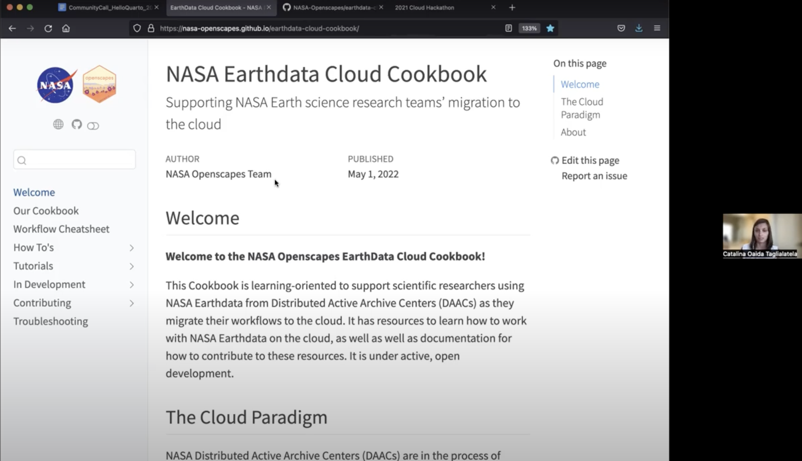

```{r setup, include=FALSE}
knitr::opts_chunk$set(echo = FALSE)
```

```{r, fig.cap = "Catalina Oaida Taglialatela screenshares the NASA Earthdata Cloud Cookbook, which is build using Quarto and accessible at https://nasa-openscapes.github.io/earthdata-cloud-cookbook/"}
# add cover image

```

[Quarto](https://quarto.org/), the new cool kid on the open data science block, extends the best features of RMarkdown (plus more!) to Python, Julia, and ObservableJS users. I got the chance to chat with folks at the forefront of exploring all that Quarto is capable of during the 6th Openscapes Community Call. Check out our post on the [`r fontawesome::fa("blog", fill = "#64605F", a11y = "sem")` Openscapes Blog](https://www.openscapes.org/blog/2022/06/22/hello-quarto/), were we summarize some of what we discussed, from publishing Quarto websites and slide decks, to how Quarto enables seamless integration between different language users, to how *amazingly easy* it is to insert automatically-generated citations into your Quarto documents.

Find the full event recording  [`r fontawesome::fa("video", fill = "#64605F", a11y = "sem")` here](https://www.youtube.com/watch?v=azVAl343CIU)!
