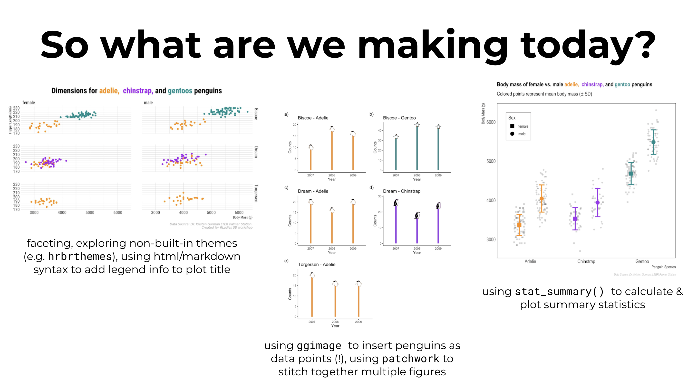

```{r setup, include=FALSE}
knitr::opts_chunk$set(echo = FALSE)
```

```{r}

```

<br>

[`r fontawesome::fa("tv", fill = "#64605F", a11y = "sem")` slides](https://docs.google.com/presentation/d/1sU2H89F5e409WpYilRqYAqu7DdXSAivccEa4y44xZ7c/edit?usp=sharing) ~~ [`r fontawesome::fa("github-square", fill = "#64605F", a11y = "sem")` GitHub Repo](https://github.com/j-verstaen/RLadiesSB-Data-Viz-Pt1) ~~ [`r fontawesome::fa("meetup", fill = "#64605F", a11y = "sem")` Meetup Event](https://www.meetup.com/rladies-santa-barbara/events/272478115/)

# Overview

This live-coding workshop was given to [R-Ladies Santa Barbara](https://www.meetup.com/rladies-santa-barbara/) via Zoom.

# Abstract 

In this code-along workshop, we review `ggplot2` basics and exploring different ways to make customizing plots fun and easy.

