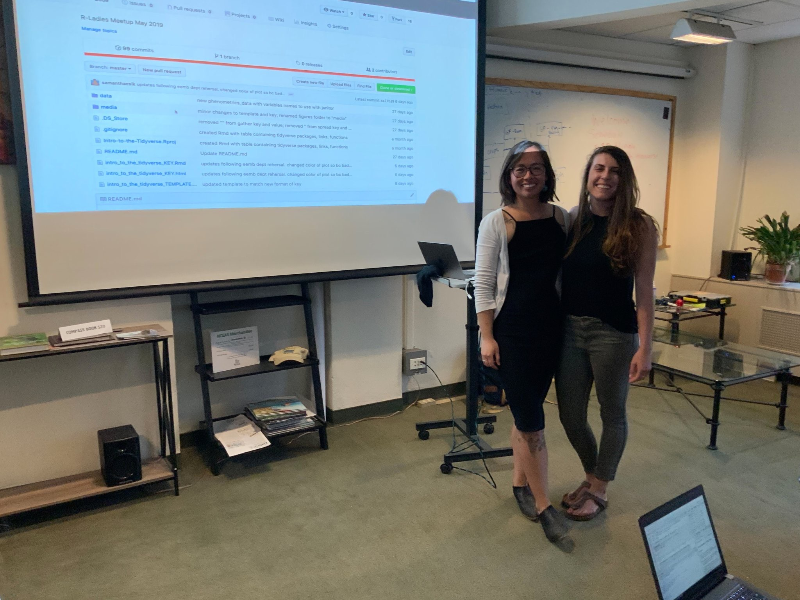

```{r setup, include=FALSE}
knitr::opts_chunk$set(echo = FALSE)
```

```{r, fig.cap = "An Bui and I getting ready to teach our very first R workshop to R-Ladies SB, hosted at NCEAS", fig.alt = "Two women, Sam and An, stand smiling in front of a projector screen with a GitHub repository on display."}

```

<br>

[`r fontawesome::fa("markdown", fill = "#64605F", a11y = "sem")` knitted html](https://rpubs.com/scsik/RladiesSB-intro-to-the-tidyverse) ~~ [`r fontawesome::fa("github-square", fill = "#64605F", a11y = "sem")` GitHub Repo](https://github.com/samanthacsik/Intro-to-the-Tidyverse) ~~ [`r fontawesome::fa("meetup", fill = "#64605F", a11y = "sem")` Meetup Event](https://www.meetup.com/rladies-santa-barbara/events/260710376/)


# Overview

My *very first time* (co)leading an R-based live-coding workshop(!) and the experience that got me hooked on teaching RStats/data science ❤️, given to [R-Ladies Santa Barbara](https://www.meetup.com/rladies-santa-barbara/).

# Abstract 

In this live-coding workshop, we teach useful functions for data tidying, wrangling and visualization using tidyverse packages & functions (e.g. `dplyr`, `tidyr`, `ggplot2`, `forcats`, etc.). This session is intended for R users at any level, whether it's your first time exploring the tidyverse or if you're refreshing your wrangling skills!


